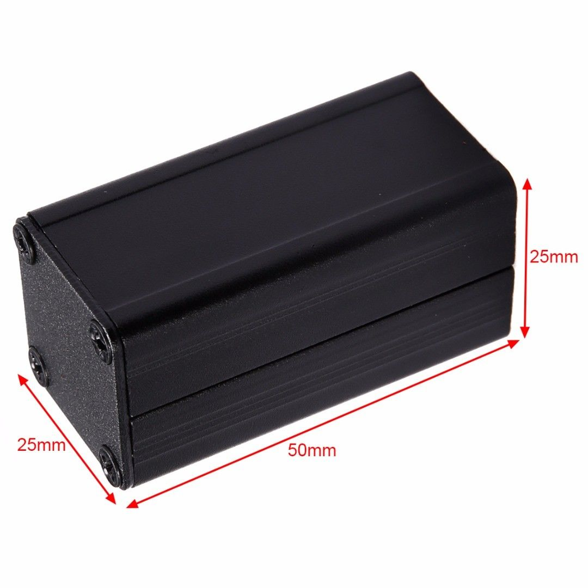

# Flatcable Jig endpoint
Flatcables are a bit more convienient (and cheaper) to link up test jigs or projects together. This is an initial test of this and serves as a endpoint for these cables.
## Work
Current tasklist:
* schematic entry (Done)
* PCB layout (Done)
* Review with one night in between (TODO)
* Produce at [OSHPARK](https://oshpark.com/) (TODO)
* Assemble (TODO)
* Test & characterise (TODO)
* update Readme.md with pictures and BOM (TODO)
## BOM
Using extruded aluminium miniboxes, 25mm wide 50mm long. 

Get them from your favorite chinese material vendor, I usually get them in bulk from ebay. They accept a 22mm wide in their slots.
## Pictures

